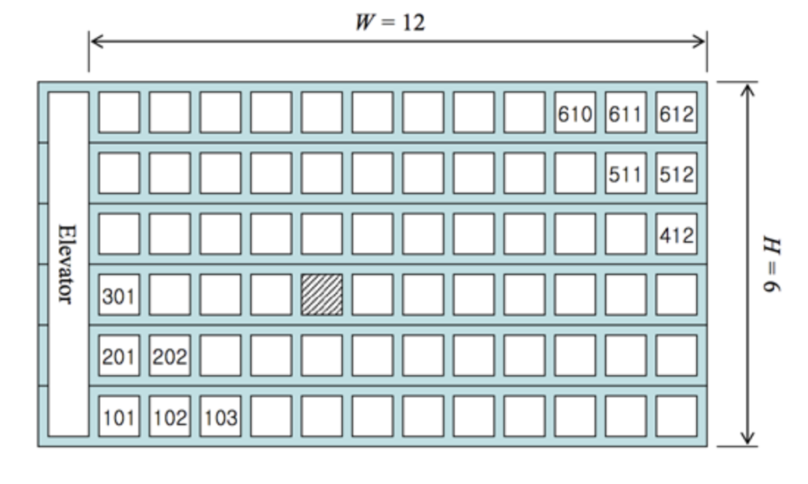

# Operation

## Print

> baekjoon

* [Level 0 : 랜덤 게임~](http://acmicpc.net/problem/10943)
  * [Update solution](https://github.com/seanhwangg/algorithm/edit/main/syntax/operation/print/BJ_10943.md)




> Question

```txt
Output: 1
```




```py
print(1)
```




* [Level 0 : 정ㅋ벅ㅋ](http://acmicpc.net/problem/1237)
  * [Update solution](https://github.com/seanhwangg/algorithm/edit/main/syntax/operation/print/BJ_1237.md)




> Question

```txt
Output: 문제의 정답
```




```sh
echo 문제의 정답
```




```py
print("문제의 정답")
```




* [Level 0 : 타노스](http://acmicpc.net/problem/15802)
  * [Update solution](https://github.com/seanhwangg/algorithm/edit/main/syntax/operation/print/BJ_15802.md)




> Question

* print 0 or 1, (half of change getting right)

```txt
Input: sean
Output: 1
```




```py
print(1)
```




* [Level 1 : 나는 누구인가](http://acmicpc.net/problem/15733)
  * [Update solution](https://github.com/seanhwangg/algorithm/edit/main/syntax/operation/print/BJ_15733.md)




> Question

```txt
Output:
I'm Sexy
```




```py
print("I'm Sexy")
```




* [Level 1 : 새로운 시작](http://acmicpc.net/problem/15962)
  * [Update solution](https://github.com/seanhwangg/algorithm/edit/main/syntax/operation/print/BJ_15962.md)




> Question

```txt
Output: 파이팅!!
```




```py
print("파이팅!!")
```




* [Level 1 : 오늘 날짜](http://acmicpc.net/problem/10699)
  * [Update solution](https://github.com/seanhwangg/algorithm/edit/main/syntax/operation/print/BJ_10699.md)




> Question

* Print todays date

```txt
Output: 2015-01-24
```




```py
print("2015-01-24")
```




* [Level 1 : Hello World](http://acmicpc.net/problem/2557)
  * [Update solution](https://github.com/seanhwangg/algorithm/edit/main/syntax/operation/print/BJ_2557.md)




> Question

```txt
Output: Hello World!
```




```sh
echo Hello World!
```




```py
print("Hello World!")
```




```v
module test;
  initial begin
    $display("Hello World!");
  end
endmodule
```




* [Level 1 : 와이버스 부릉부릉](http://acmicpc.net/problem/14645)
  * [Update solution](https://github.com/seanhwangg/algorithm/edit/main/syntax/operation/print/BJ_14645.md)




> Question

```txt
Output: 비와이
```




```py
print(‘비와이’)
```




* [Level 1 : 등록](http://acmicpc.net/problem/7287)
  * [Update solution](https://github.com/seanhwangg/algorithm/edit/main/syntax/operation/print/BJ_7287.md)




> Question

* Print number of solved question and your id

```txt
Output:
123
icpcname
```




```py
print(123)
print('Your_ICPC_Team_Name')
```




* [Level 1 : We love kriii](http://acmicpc.net/problem/10718)
  * [Update solution](https://github.com/seanhwangg/algorithm/edit/main/syntax/operation/print/BJ_10718.md)




> Question

```txt
Output:
강한친구 대한육군
강한친구 대한육군
```




```sh
echo -e "강한친구 대한육군\n강한친구 대한육군"
```




```py
print("강한친구 대한육군")
print('강한친구 대한육군')
```




* [Level 1 : Арифметическая магия](http://acmicpc.net/problem/18096)
  * [Update solution](https://github.com/seanhwangg/algorithm/edit/main/syntax/operation/print/BJ_18096.md)




> Question

```txt
Output: 1
```




```py
print(1)
```




* [Level 1 : 오늘의 날짜는?](http://acmicpc.net/problem/16170)
  * [Update solution](https://github.com/seanhwangg/algorithm/edit/main/syntax/operation/print/BJ_16170.md)




> Question

* Print today's date

```txt
Output:
2020
05
23
```




```py
print(2020)
print('05')
print(23)
```




* [Level 1 : 고려대는 사랑입니다](http://acmicpc.net/problem/11942)
  * [Update solution](https://github.com/seanhwangg/algorithm/edit/main/syntax/operation/print/BJ_11942.md)




> Question

```txt
Output: 고려대는 사랑입니다
```




```py
print("고려대는 사랑입니다")
```




* [Level 1 : 엔드게임 스포일러](http://acmicpc.net/problem/17295)
  * [Update solution](https://github.com/seanhwangg/algorithm/edit/main/syntax/operation/print/BJ_17295.md)




> Question

```txt
Output: Avengers: Endgame
```




```py
print("Avengers: Endgame")
```




* [Level 2 : F](http://acmicpc.net/problem/14935)
  * [Update solution](https://github.com/seanhwangg/algorithm/edit/main/syntax/operation/print/BJ_14935.md)




> Question

```txt
Output: FA
```




```py
print('FA')
```




* [Level 3 : 행운의 편지](http://acmicpc.net/problem/13311)
  * [Update solution](https://github.com/seanhwangg/algorithm/edit/main/syntax/operation/print/BJ_13311.md)




> Question

```txt
Output: 1
```




```sh
echo 1
```




```py
print(1)
```




> kattis

* [Level 1.3 : Hello World!](https://open.kattis.com/problems/hello)
  * [Update solution](https://github.com/seanhwangg/algorithm/edit/main/syntax/operation/print/KT_hello.md)

[//]: # (BJ_2557)

### Multiline

> baekjoon

* [Level 1 : 웰컴](http://acmicpc.net/problem/5337)
  * [Update solution](https://github.com/seanhwangg/algorithm/edit/main/syntax/operation/multiline/BJ_5337.md)




> Question

```txt
Output:
.  .   .
|  | _ | _. _ ._ _  _
|/\|(/.|(_.(_)[ | )(/.
```




```sh
echo -e ".  .   .\n|  | _ | _. _ ._ _  _\n|/\\|(/.|(_.(_)[ | )(/."
```




```py
print(""".  .   .
|  | _ | _. _ ._ _  _
|/\\|(/.|(_.(_)[ | )(/.""")
```




* [Level 1 : 나부 함대 데이터](http://acmicpc.net/problem/9654)
  * [Update solution](https://github.com/seanhwangg/algorithm/edit/main/syntax/operation/multiline/BJ_9654.md)




> Question

```txt
Output:
SHIP NAME      CLASS          DEPLOYMENT IN SERVICE
N2 Bomber      Heavy Fighter  Limited    21
J-Type 327     Light Combat   Unlimited  1
NX Cruiser     Medium Fighter Limited    18
N1 Starfighter Medium Fighter Unlimited  25
Royal Cruiser  Light Combat   Limited    4
```




```py
print("""SHIP NAME      CLASS          DEPLOYMENT IN SERVICE
N2 Bomber      Heavy Fighter  Limited    21
J-Type 327     Light Combat   Unlimited  1
NX Cruiser     Medium Fighter Limited    18
N1 Starfighter Medium Fighter Unlimited  25
Royal Cruiser  Light Combat   Limited    4         """)
```




* [Level 1 : 개](http://acmicpc.net/problem/10172)
  * [Update solution](https://github.com/seanhwangg/algorithm/edit/main/syntax/operation/multiline/BJ_10172.md)




> Question

```txt
Output:
|\_/|
|q p|   /}
( 0 )"""\
|"^"`    |
||_/=\\__|
```




```py
print('''|\\_/|
|q p|   /}
( 0 )"""\\
|"^"`    |
||_/=\\\\__|''')
```




* [Level 1 : 고양이](http://acmicpc.net/problem/10171)
  * [Update solution](https://github.com/seanhwangg/algorithm/edit/main/syntax/operation/multiline/BJ_10171.md)




> Question

```txt
Output:
\    /\
 )  ( ')
(  /  )
 \(__)|
```




```sh
echo -e "\\    /\\ \n )  ( ')\n(  /  )\n \\(__)|"
```




```py
print("""\    /\\
 )  ( ')
(  /  )
 \\(__)|""")
```




* [Level 1 : NFC West vs North](http://acmicpc.net/problem/10170)
  * [Update solution](https://github.com/seanhwangg/algorithm/edit/main/syntax/operation/multiline/BJ_10170.md)




> Question

```txt
Output:
NFC West       W   L  T
-----------------------
Seattle        13  3  0
San Francisco  12  4  0
Arizona        10  6  0
St. Louis      7   9  0
NFC North      W   L  T
-----------------------
Green Bay      8   7  1
Chicago        8   8  0
Detroit        7   9  0
Minnesota      5  10  1
```




```go
package main

import "fmt"
func main() {
  fmt.Println(`.  .   .
|  | _ | _. _ ._ _  _
|/\|(/.|(_.(_)[ | )(/.
  `)
}
```




```js
console.log(`.  .   .
|  | _ | _. _ ._ _  _
|/\\|(/.|(_.(_)[ | )(/.`);
```




```py
print("""NFC West       W   L  T
-----------------------
Seattle        13  3  0
San Francisco  12  4  0
Arizona        10  6  0
St. Louis      7   9  0
NFC North      W   L  T
-----------------------
Green Bay      8   7  1
Chicago        8   8  0
Detroit        7   9  0
Minnesota      5  10  1
""")
```




* [Level 1 : 콜센터](http://acmicpc.net/problem/5339)
  * [Update solution](https://github.com/seanhwangg/algorithm/edit/main/syntax/operation/multiline/BJ_5339.md)




> Question

```txt
Output:
     /~\
    ( oo|
    _\=/_
   /  _  \
  //|/.\|\\
 ||  \ /  ||
============
|          |
|          |
|          |
```




```py
print("""     /~\\
    ( oo|
    _\\=/_
   /  _  \\
  //|/.\\|\\\\
 ||  \\ /  ||
============
|          |
|          |
|          |""")
```




* [Level 1 : 마이크로소프트 로고](http://acmicpc.net/problem/5338)
  * [Update solution](https://github.com/seanhwangg/algorithm/edit/main/syntax/operation/multiline/BJ_5338.md)




> Question

```txt
Output:
       _.-;;-._
'-..-'|   ||   |
'-..-'|_.-;;-._|
'-..-'|   ||   |
'-..-'|_.-''-._|
```




```py
print("""       _.-;;-._
'-..-'|   ||   |
'-..-'|_.-;;-._|
'-..-'|   ||   |
'-..-'|_.-''-._|""")
```




* [Level 1 : 스타워즈 로고](http://acmicpc.net/problem/9653)
  * [Update solution](https://github.com/seanhwangg/algorithm/edit/main/syntax/operation/multiline/BJ_9653.md)




> Question

```txt
Output:
    8888888888  888    88888
   88     88   88 88   88  88
    8888  88  88   88  88888
       88 88 888888888 88   88
88888888  88 88     88 88    888888
88  88  88   888    88888    888888
88  88  88  88 88   88  88  88
88 8888 88 88   88  88888    8888
 888  888 888888888 88  88      88
  88  88  88     88 88   88888888
```




```py
print("""    8888888888  888    88888
   88     88   88 88   88  88
    8888  88  88   88  88888
       88 88 888888888 88   88
88888888  88 88     88 88    888888
88  88  88   888    88888    888888
88  88  88  88 88   88  88  88
88 8888 88 88   88  88888    8888
 888  888 888888888 88  88      88
  88  88  88     88 88   88888888""")
```




### Format

* [Format Test](https://docs.google.com/forms/d/130h90EKvP9CJPECDq9NEEFvjX5NCXkSlBqkZWGHXKJk/edit)




```js
name = “sean”
`hi ${name}`    // hi sean
```




> baekjoon

* [Level 2 : Judging Moose](http://acmicpc.net/problem/15025)
  * [Update solution](https://github.com/seanhwangg/algorithm/edit/main/syntax/operation/format/BJ_15025.md)




> Question

* 왼쪽과 오른쪽의 뿔의 개수가 주어진다
* 왼쪽과 오른쪽의 뿔의 개수가 같을 때 → Even 총_뿔수
* 다를 시 → Odd 더_많은_뿔수 * 2
* 뿔이 하나도 없을 시 → Not a Moose

```txt
Input: 2 3
Output: Odd 6
```




```py
a, b = map(int, input().split())
if a == b == 0:
  print("Not a moose")
elif a == b:
  print(f"Even, {a * 2}")
else:
  print(f"Odd, {max(a, b) * 2}")
```




* [Level 3 : Gauß](http://acmicpc.net/problem/7523)
  * [Update solution](https://github.com/seanhwangg/algorithm/edit/main/syntax/operation/format/BJ_7523.md)




> Question

* For each test, find sum between a, b

```txt
Input:
3
1 100
-11 10
-89173 938749341

Output:
Scenario #1:
5050

Scenario #2:
-11

Scenario #3:
440625159107385260
```




```py
for i in range(int(input())):
  a, b = map(int, (input().split()))
  print(f"Scenario #{i + 1}:")
  print((b - a + 1) * (a + b) // 2)
  print()
```




* [Level 3 : 배수 찾기](http://acmicpc.net/problem/4504)
  * [Update solution](https://github.com/seanhwangg/algorithm/edit/main/syntax/operation/format/BJ_4504.md)




> Question

* Print if b if multiple of a

```txt
Input:
3
1
7
99
321
777
0

Output:
1 is NOT a multiple of 3.
7 is NOT a multiple of 3.
99 is a multiple of 3.
321 is a multiple of 3.
777 is a multiple of 3.
```




```py
a = int(input())
while True:
  b = int(input())
  if b == 0:
    break
  if b % a == 0:
    print(f"{b} is a multiple of {a}.")
  else:
    print(f"{b} is NOT a multiple of {a}.")
```




* [Level 3 : 사분면](http://acmicpc.net/problem/9610)
  * [Update solution](https://github.com/seanhwangg/algorithm/edit/main/syntax/operation/format/BJ_9610.md)




> Question

* Count number of points on each coordinate and axis

```txt
Input:
5
0 0
0 1
1 1
3 -3
2 2

Output:
Q1: 2
Q2: 0
Q3: 0
Q4: 1
AXIS: 2
```




```py
q1 = q2 = q3 = q4 = axis = 0
N = int(input())
for _ in range(N):
  x, y = map(int, input().split())
  if x == 0 or y == 0:
    axis += 1
  elif x > 0 and y > 0:
    q1 += 1
  elif x < 0 and y > 0:
    q2 += 1
  elif x < 0 and y < 0:
    q3 += 1
  elif x > 0 and y < 0:
    q4 += 1
print(f"Q1: {q1}", f"Q2: {q2}", f"Q3: {q3}" f"Q4: {q4}" f"AXIS: {axis}", sep="\n")
```




* [Level 3 : A+B - 7](http://acmicpc.net/problem/11021)
  * [Update solution](https://github.com/seanhwangg/algorithm/edit/main/syntax/operation/format/BJ_11021.md)




> Question

* Print sum of pairs in each case

```txt
Input:
5
1 1
2 3
3 4
9 8
5 2

Output:
Case #1: 2
Case #2: 5
Case #3: 7
Case #4: 17
Case #5: 7
```




```py
for i in range(1, int(input()) + 1):
  a, b = map(int, input().split())
  print(f"Case #{i}: {a + b}")
```




* [Level 3 : Hello Judge](http://acmicpc.net/problem/9316)
  * [Update solution](https://github.com/seanhwangg/algorithm/edit/main/syntax/operation/format/BJ_9316.md)




> Question

* Print Hello World, Judge i, n times

```txt
Input: 3

Output:
Hello World, Judge 1!
Hello World, Judge 2!
Hello World, Judge 3!
```




```py
n = int(input())
for i in range(1, n + 1):
  print(f"Hello World, Judge {i}!")
```




* [Level 3 : A+B - 8](http://acmicpc.net/problem/11022)
  * [Update solution](https://github.com/seanhwangg/algorithm/edit/main/syntax/operation/format/BJ_11022.md)




> Question

* outputs in the form "Case #x: A + B = C" x is a test case number and starts at 1, and C is A + B

```txt
Input:
5
1 1
2 3
3 4
9 8
5 2

Output:
Case #1: 1 + 1 = 2
Case #2: 2 + 3 = 5
Case #3: 3 + 4 = 7
Case #4: 9 + 8 = 17
Case #5: 5 + 2 = 7
```




```py
n_test = int(input())
for i in range(1, n_test + 1):
  a, b = map(int, input().split())
  print(f"Case #{i}: {a} + {b} = {a + b}")
```




* [Level 3 : 세 수](http://acmicpc.net/problem/2985)
  * [Update solution](https://github.com/seanhwangg/algorithm/edit/main/syntax/operation/format/BJ_2985.md)




> Question

* Given Three integers, find equation using operations

```txt
Input: 5 3 8
Output: 5+3=8
```




```py
a, b, c = map(int, input().split())
if a + b == c:
  print(f"{a}+{b}={c}")
elif a - b == c:
  print(f"{a}-{b}={c}")
elif a * b == c:
  print(f"{a}*{b}={c}")
elif a // b == c:
  print(f"{a}/{b}={c}")
elif a == b + c:
  print(f"{a}={b}+{c}")
elif a == b - c:
  print(f"{a}={b}-{c}")
elif a == b * c:
  print(f"{a}={b}*{c}")
elif a == b // c:
  print(f"{a}={b}/{c}")
```




* [Level 3 : 구구단](http://acmicpc.net/problem/2739)
  * [Update solution](https://github.com/seanhwangg/algorithm/edit/main/syntax/operation/format/BJ_2739.md)




> Question

* Print multiplication table

```txt
Input: 2
Output:
2 * 1 = 2
2 * 2 = 4
2 * 3 = 6
2 * 4 = 8
2 * 5 = 10
2 * 6 = 12
2 * 7 = 14
2 * 8 = 16
2 * 9 = 18
```




```js
var input = require('fs').readFileSync('/dev/stdin').toString().trim()

for (i = 1; i <= 9; i++) {
  console.log(input + " * " + i + " = " + i*input)
}
```




```sh
read n
for i in {1..9}; do
  echo "$n * $i = $(($n*$i))"
done
```




```py
a = int(input())
for i in range(1, 10):
  print(f"{a} * {i} = {a * i}")
```




* [Level 3 : 할로윈의 사탕](http://acmicpc.net/problem/10178)
  * [Update solution](https://github.com/seanhwangg/algorithm/edit/main/syntax/operation/format/BJ_10178.md)




> Question

* When the father distributes candy to his children as much as he can, find how many candies he has left

```txt
Input:
5
22 3
15 5
99 8
7 4
101 5

Output:
You get 7 piece(s) and your dad gets 1 piece(s).
You get 3 piece(s) and your dad gets 0 piece(s).
You get 12 piece(s) and your dad gets 3 piece(s).
You get 1 piece(s) and your dad gets 3 piece(s).
You get 20 piece(s) and your dad gets 1 piece(s).
```




```py
for _ in range(int(input())):
  a, b = map(int, input().split())
  print(f'You get {a//b} piece(s) and your dad gets {a%b} piece(s).')
```




* [Level 4 : 줄번호](http://acmicpc.net/problem/4470)
  * [Update solution](https://github.com/seanhwangg/algorithm/edit/main/syntax/operation/format/BJ_4470.md)




> Question

* Print string with line number

```txt
Input:
5
Lionel Cosgrove
Alice
Columbus and Tallahassee
Shaun and Ed
Fido

Output:
1. Lionel Cosgrove
2. Alice
3. Columbus and Tallahassee
4. Shaun and Ed
5. Fido
```




```cpp
#include <bits/stdc++.h>
using namespace std;

int main() {
  int n; cin >> n;
  cin.ignore();
  for (int i = 1; i <= n; i++) {
    string s;
    getline(cin, s);
    cout << i << ". " << s << '\n';
  }
  return 0;
}
```




```py
for i in range(int(input())):
  print(f'{i + 1} {input()}')
```




* [Level 5 : 맥주 99병](http://acmicpc.net/problem/17293)
  * [Update solution](https://github.com/seanhwangg/algorithm/edit/main/syntax/operation/format/BJ_17293.md)




> Question

* K bottles of beer on the wall, K bottles of beer
* Take one down and pass it around, K-1 bottles of beer on the wall
  * If there is one bottle, omit s
  * If there is 0 bottle, print no more bottles
* No more bottles of beer on the wall, no more bottles of beer
* Go to the store and buy some more, N bottles of beer on the wall

```txt
Input: 3
Output:
3 bottles of beer on the wall, 3 bottles of beer.
Take one down and pass it around, 2 bottles of beer on the wall.

2 bottles of beer on the wall, 2 bottles of beer.
Take one down and pass it around, 1 bottle of beer on the wall.

1 bottle of beer on the wall, 1 bottle of beer.
Take one down and pass it around, no more bottles of beer on the wall.

No more bottles of beer on the wall, no more bottles of beer.
Go to the store and buy some more, 3 bottles of beer on the wall.
```




```py
n = int(input())

for i in range(n, 0, -1):
  b = 'bottle' if i == 1 else 'bottles'
  print(f'{i} {b} of beer on the wall, {i} {b} of beer.')
  b = 'bottle' if i == 2 else 'bottles'
  print(f'Take one down and pass it around, {"no more" if i==1 else i-1} {b} of beer on the wall.')
  print()
print('No more bottles of beer on the wall, no more bottles of beer.')
print(f'Go to the store and buy some more, {"1 bottle" if n == 1 else str(n) + " bottles"} of beer on the wall.')
```




* [Level 5 : Box of Bricks](http://acmicpc.net/problem/6318)
  * [Update solution](https://github.com/seanhwangg/algorithm/edit/main/syntax/operation/format/BJ_6318.md)




> Question

* Print minimum number of moves to make all bricks' height equal

```txt
Input:
6
5 2 4 1 7 5
0

Output:
Set #1
The minimum number of moves is 5.
```




```cpp
#include <bits/stdc++.h>
using namespace std;

int n, ans, sum, cas = 1, avg, h[50];

int main() {
  while (cin >> n && n) {
    sum = ans = 0;
    for (int i = 0; i < n; i++)
      cin >> h[i], sum += h[i];
    avg = sum / n;
    for (int i = 0; i < n; i++)
      if (h[i] > avg)
        ans += h[i] - avg;
    printf("Set #%d\nThe minimum number of moves is %d.\n\n", cas++, ans);
  }
  return 0;
}
```




```py
i = 1
while n := int(input()):
  s = [*map(int,input().split())]
  m = sum(s) // n
  print(f'Set #{i}\nThe minimum number of moves is {sum(abs(i - m) for i in s) // 2}.\n')
  i += 1
```




> kattis

* [Level 1.3 : Stuck In A Time Loop](https://open.kattis.com/problems/timeloop)
  * [Update solution](https://github.com/seanhwangg/algorithm/edit/main/syntax/operation/format/KT_timeloop.md)




> Question

* Given N, Print 1 Abracadabra … N Abracadabra

```txt
Input: 2
Output:
1 Abracadabra
2 Abracadabra
```




```py
n_line = int(input())
for i in range(1, n_line + 1):
  print(f"{i} Abracadabra")
```




* [Level 1.4 : Judging Moose](https://open.kattis.com/problems/judgingmoose)
  * [Update solution](https://github.com/seanhwangg/algorithm/edit/main/syntax/operation/format/KT_judgingmoose.md)




> Question

* 왼쪽과 오른쪽의 뿔의 개수가 주어진다
* 왼쪽과 오른쪽의 뿔의 개수가 같을 때, Even 총_뿔수
* 다를 시, Odd 더_많은_뿔수 * 2
* 뿔이 하나도 없을 시, Not a Moose를 출력한다

```txt
Input: 2 3
Output: Odd 6
```




```py
a, b = map(int, input().split())
if a == b == 0:
  print("not a moose")
elif a == b:
  print(f"Even {a * 2}")
else:
  print(f"Odd {max(a, b) * 2}")
```




* [Level 1.8 : One Chicken Per Person!](https://open.kattis.com/problems/onechicken)
  * [Update solution](https://github.com/seanhwangg/algorithm/edit/main/syntax/operation/format/KT_onechicken.md)




> Question

* a, b가 주어진다
* a 가 b 보다 크면 Dr. Chaz needs a - b more pieces of chicken!
* b 가 a 보다 크면 Dr. Chaz will have b - a pieces of chicken left over! 를 출력하라. (이 때 차이가 1이면 s는 pieces를 piece로 대체한다.)

```txt
Input: 20 100
Output: Dr. Chaz will have 80 pieces of chicken left over!
```




```py
a, b = map(int, input().split())
if a < b:
  print(f"Dr. Chaz will have {b - a} piece{'' if b - a == 1 else 's'} of chicken left over!")
else:
  print(f"Dr. Chaz needs {a - b} more piece{'' if a - b == 1 else 's'} of chicken!")
```




* [Level 1.9 : Oddities](https://open.kattis.com/problems/oddities)
  * [Update solution](https://github.com/seanhwangg/algorithm/edit/main/syntax/operation/format/KT_oddities.md)




> Question

* n 이 짝수이면 n is even 홀수이면 n is odd 라고 출력하라

```txt
Input:
2
1
2

Output:
1 is even
2 is odd
```




```py
for _ in range(int(input())):
  n = int(input())
  if n % 2 == 0:
    print(f"{n} is even")
  else:
    print(f"{n} is odd")
```




### Format Number

> baekjoon

* [Level 2 : 쿠폰](http://acmicpc.net/problem/10179)
  * [Update solution](https://github.com/seanhwangg/algorithm/edit/main/syntax/operation/format-number/BJ_10179.md)




> Question

* Print 20% discounted price up to second decimal points

```txt
Input:
3
100.00
59.99
20.00

Output:
$80.00
$47.99
$16.00
```




```py
N = int(input())
for _ in range(N):
  price = float(input())
  print(f"${price * 0.8:.2f}")
```




* [Level 3 : Lunacy](http://acmicpc.net/problem/4714)
  * [Update solution](https://github.com/seanhwangg/algorithm/edit/main/syntax/operation/format-number/BJ_4714.md)




> Question

* Weight on moon is, * 0,167
* print weight on earth and moon each line

```txt
Input:
100.0
12.0
0.12
120000.0
-1.0

Output:
Objects weighing 100.00 on Earth will weigh 16.70 on the moon.
Objects weighing 12.00 on Earth will weigh 2.00 on the moon.
Objects weighing 0.12 on Earth will weigh 0.02 on the moon.
Objects weighing 120000.00 on Earth will weigh 20040.00 on the moon.
```




```py
while 1:
  n = float(input())
  if n<0:
    break
  print(f"Objects weighing {n:.2f} on Earth will weigh {n * 0.167:.2f} on the moon.")
```




* [Level 3 : 경고](http://acmicpc.net/problem/3029)
  * [Update solution](https://github.com/seanhwangg/algorithm/edit/main/syntax/operation/format-number/BJ_3029.md)




> Question

* Print difference in time
* If they are same print 24:00:00

```txt
Input:
20:00:00
04:00:00

Output:
08:00:00
```




```py
h1, m1, s1 = map(int, input().split(':'))
h2, m2, s2 = map(int, input().split(':'))
t1 = h1 * 3600 + m1 * 60 + s1
t2 = h2 * 3600 + m2 * 60 + s2
d = t2 - t1 if t2 > t1 else t2 + 86400 - t1
print(f"{d // 3600:02}:{d % 3600 // 60:02}:{d % 60:02}")
```




* [Level 3 : 전투 드로이드 가격](http://acmicpc.net/problem/5361)
  * [Update solution](https://github.com/seanhwangg/algorithm/edit/main/syntax/operation/format-number/BJ_5361.md)




> Question

* Given Costs for each part is $350.34, $230.90, $190.55, $125.30, $180.90
* Print total price with 2 decimal

```txt
Input:
3
20 10 14 3 9
19 17 12 8 10
11 9 8 22 33

Output:
$13987.50
$15679.76
$16182.54
```




```cpp
#include <bits/stdc++.h>
using namespace std;

int T;
double A[] = { 350.34, 230.90, 190.55, 125.30, 180.90 };

int main() {
  cin >> T;
  while (T--) {
    auto ans = 0.0;
    for (int i = 0; i < 5; ++i) {
      double v;
      cin >> v;
      ans += v * A[i];
    }
    cout << "$" << fixed << setprecision(2) << ans << '\n';
  }
}
```




```java
import java.util.*;
import java.math.*;

public class Main {

  public static void main(String[] args) {
    Scanner sc = new Scanner(System.in);
    int a = sc.nextInt();
    double[] aa = {350.34,230.90,190.55,125.30,180.90};
    for(int i=0;i<a;i++) {
      double sum = 0;
      for(int j=0;j<5;j++)
        sum += aa[j] * sc.nextDouble();
      System.out.printf("$%.2f\n",sum);
    }
  }
}
```




```py
for _ in range(int(input())):
  a, b, c, d, e = map(int, input().split())
  total = a * 350.34 + b * 230.90 + c * 190.55 + d * 125.30 + e *180.90
  print('$%.2f' %total)
```




* [Level 3 : 직각 삼각형의 두 변](http://acmicpc.net/problem/6322)
  * [Update solution](https://github.com/seanhwangg/algorithm/edit/main/syntax/operation/format-number/BJ_6322.md)




> Question

* Given the length of two sides of a right triangle, determine the length of one side
* Print up to 3rd decimal points

```txt
Input:
3 4 -1
-1 2 7
5 -1 3
0 0 0

Output:
Triangle #1
c = 5.000

Triangle #2
a = 6.708

Triangle #3
Impossible.
```




```py
i = 1
while True:
  a,b,c = map(int, input().split())
  if a, b, c == 0, 0, 0:
    break
  print(f'Triangle #{i}')
  i += 1
  if a == -1:
    print('Impossible.' if c ** 2 - b ** 2 <= 0 else f'a = {(c ** 2 - b ** 2) ** 0.5:.3f}')
  elif b == -1:
    print('Impossible.' if c ** 2 - a ** 2 <= 0 else f'b = {(c ** 2 - a ** 2) ** 0.5:.3f}')
  else:
    print(f'c = {(a ** 2 + b ** 2) ** 0.5:.3f}')
  print()
```




* [Level 3 : ACM 호텔](http://acmicpc.net/problem/10250)
  * [Update solution](https://github.com/seanhwangg/algorithm/edit/main/syntax/operation/format-number/BJ_10250.md)




> Question



* Customers don't care about the distance they travel by elevator
* However, when the walking distance is the same, the room downstairs is preferred
* The contents print the room number to be assigned to the Nth guest

```txt
Input:
2
6 12 10
30 50 72

Output:
402
1203
```




```py
for _ in range(int(input())):
  h, w, n = map(int,input().split())
  print(f'{(n - 1) % h + 1}{(n - 1)// h + 1:02}')
```




* [Level 3 : 일반 화학 실험](http://acmicpc.net/problem/4766)
  * [Update solution](https://github.com/seanhwangg/algorithm/edit/main/syntax/operation/format-number/BJ_4766.md)




> Question

* Given the measured temperature, print the temperature that has changed up to 2 decimal
* The last number is 999

```txt
Input:
10.0
12.05
30.25
20
999

Output:
2.05
18.20
-10.25
```




```py
last = float(input())
while True:
  n = float(input())
  if n == 999:
    break
  print(f"{n - last:.2f}")
  last = n
```




* [Level 4 : 24](http://acmicpc.net/problem/1408)
  * [Update solution](https://github.com/seanhwangg/algorithm/edit/main/syntax/operation/format-number/BJ_1408.md)




> Question

* Find difference in time

```txt
Input:
13:52:30
14:00:00

Output: 00:07:30
```




```py
s1 = list(map(int, input().split(':')))
s2 = list(map(int, input().split(':')))
t1 = s1[0] * 3600 + s1[1] * 60 + s1[2]
t2 = s2[0] * 3600 + s2[1] * 60 + s2[2]
t2 -= t1
if t2 < 0:
  t2 += 3600 * 24
print(f'{t2//3600:0>2}:{t2%3600//60:0>2}:{t2%60:0>2}')
```




* [Level 4 : 나누기](http://acmicpc.net/problem/1075)
  * [Update solution](https://github.com/seanhwangg/algorithm/edit/main/syntax/operation/format-number/BJ_1075.md)




> Question

* Given N, M, we want N to be divisible by M
* print minimum two digits that replaces last two digits

```txt
Input:
1000
3

Output: 02    # 1002 % 3 == 0
```




```java
import java.util.*;
public class Main {
  public static void main(String[] args) {
    Scanner scanner = new Scanner(System.in);
    int n = scanner.nextInt(), d = scanner.nextInt();
    scanner.close();
    n -= n % 100;
    while (n++ % d != 0);
    n--;
    System.out.printf("%02d", n % 100);
  }
}
```




```py
a, b = int(input()), int(input())
a //= 100
for n in range(b):
  if (a * 100 + n) % b == 0:
    print(f'{n:02d}')
```




* [Level 5 : 평균은 넘겠지](http://acmicpc.net/problem/4344)
  * [Update solution](https://github.com/seanhwangg/algorithm/edit/main/syntax/operation/format-number/BJ_4344.md)




> Question

* In each case, the percentage of students who exceed the average is rounded up to the third decimal place

```txt
Input:
5
5 50 50 70 80 100
7 100 95 90 80 70 60 50
3 70 90 80
3 70 90 81
9 100 99 98 97 96 95 94 93 91

Output:
40.000%
57.143%
33.333%
66.667%
55.556%
```




```py
N = int(input())
for i in range(N):
  li = list(map(int, input().split()))
  av = sum(li[1:]) / li[0]
  print(f"{len([x for x in li[1:] if x > av]) / li[0]:.3%}")
```




## Arithmetic

* [What is a function?](https://www.youtube.com/watch?v=kvGsIo1TmsM)
* [Variable](https://docs.google.com/forms/d/1Mue_sBppqzcez70ukrU_N66nqM3WJPh1T5x3Q66YjZM/edit)

### Add

* [Test 1](https://docs.google.com/forms/d/1E8Y3rfUxtQlxZLPLc6tS4urMM1d3wNpLBs6ursrXP5k/edit)
* [Test 2](https://docs.google.com/forms/d/1pLBK2MS25YizpvRDLHQBYfWsFvH1Vxq1mI56Q8BC5X8/edit)




```py
# 1. Add test
a = 'python'
b = 'World'
print('xxx')
print(float(3))
print(hello)
print('sun' + "flower")
print(a+b)
print(b+5)
print('a+b')
print(int(3.9) + float(4))
print(int(a))
print(a+'3')

# 2. Subtract Test
5 + (-10)
15 - (-9)
```




> baekjoon

* [Level 0 : 더하기](http://acmicpc.net/problem/14918)
  * [Update solution](https://github.com/seanhwangg/algorithm/edit/main/syntax/operation/add/BJ_14918.md)

[//]: # (BJ_1000)

* [Level 1 : 저작권](http://acmicpc.net/problem/2914)
  * [Update solution](https://github.com/seanhwangg/algorithm/edit/main/syntax/operation/add/BJ_2914.md)




> Question

* (창영이 앨범에 수록된 곡에 포함되어 있는 저작권이 있는 멜로디의 개수) / (앨범에 수록된 곡의 개수)
* 적어도 몇 곡이 저작권이 있는 멜로디인지 구하라

```txt
Input: 38 24
Output: 875
```




```py
x, y = map(int, input().split())
print(x * (y - 1) + 1)
```




* [Level 1 : 큰 수 (BIG)](http://acmicpc.net/problem/14928)
  * [Update solution](https://github.com/seanhwangg/algorithm/edit/main/syntax/operation/add/BJ_14928.md)




> Question

* print remainder of 20000303

```txt
Input: 20000303200003032000030320000303200003032000030320000303200003032000030320000303
Output: 0
```




```py
a = int(input())
print(a % 20000303)
```




* [Level 1 : 꼬마 정민](http://acmicpc.net/problem/11382)
  * [Update solution](https://github.com/seanhwangg/algorithm/edit/main/syntax/operation/add/BJ_11382.md)




> Question

* Print a + b + c

```txt
Input: 1 5 2
Output: 8
```




```sh
read a b c
echo $(($a+$b+$c))
```




```py
a, b, c = map(int, input().split())
print(a + b + c)
```




* [Level 1 : Next in line](http://acmicpc.net/problem/6749)
  * [Update solution](https://github.com/seanhwangg/algorithm/edit/main/syntax/operation/add/BJ_6749.md)




> Question

* Given a, b, print 2 * b - a

```txt
Input:
12
15

Output: 18
```




```py
a, b = int(input()), int(input())
print(b - a + b)
```




* [Level 1 : 킹, 퀸, 룩, 비숍, 나이트, 폰](http://acmicpc.net/problem/3003)
  * [Update solution](https://github.com/seanhwangg/algorithm/edit/main/syntax/operation/add/BJ_3003.md)




> Question

* print number of pieces needed or missing from chess (1, 1, 2, 2, 2, 8)

```txt
Input: 0 1 2 2 2 7
Output: 1 0 0 0 0 1
```




```py
a, b, c, d, e, f = map(int, input().split())
print(1 - a, 1 - b, 2 - c, 2 - d, 2 - e, 8 - f)
```




* [Level 1 : A+B - 2](http://acmicpc.net/problem/2558)
  * [Update solution](https://github.com/seanhwangg/algorithm/edit/main/syntax/operation/add/BJ_2558.md)




> Question

* Print a + b

```txt
Input:
3
5

Output: 8
```




```sh
read a
read b
echo $((a+b))
```




```py
a = int(input())
b = int(input())
print(a + b)
```




* [Level 1 : A+B](http://acmicpc.net/problem/1000)
  * [Update solution](https://github.com/seanhwangg/algorithm/edit/main/syntax/operation/add/BJ_1000.md)




> Question

* Print a + b

```txt
Input: 1 2
Output: 3
```




```sh
read q w
echo $((q+w))
```




```py
a, b = map(int, input().split())
print(a + b)
```




```r
cat(sum(scan("stdin")))
```




```v
module main;
  integer a, b, c;
  initial
    begin
      c = $fscanf(32'h8000_0000, "%d %d", a, b);
      $display("%0d", a + b);
        $finish;
    end
endmodule
```




* [Level 1 : A+B - 9](http://acmicpc.net/problem/15740)
  * [Update solution](https://github.com/seanhwangg/algorithm/edit/main/syntax/operation/add/BJ_15740.md)




> Question

* print a + b

```txt
Input: -60 40
Output: -20
```




```py
a, b = map(int, input().split())
print(a + b)
```




* [Level 1 : 수학은 체육과목 입니다](http://acmicpc.net/problem/15894)
  * [Update solution](https://github.com/seanhwangg/algorithm/edit/main/syntax/operation/add/BJ_15894.md)




> Question

* print a * 4

```txt
Input: 3
Output: 12
```




```py
a = int(input())
print(a * 4)
```




* [Level 1 : 홍익대학교](http://acmicpc.net/problem/16394)
  * [Update solution](https://github.com/seanhwangg/algorithm/edit/main/syntax/operation/add/BJ_16394.md)




> Question

* Hongik University opened in 1946
* When given a particular year, print out how old it is

```txt
Input: 2018
Output: 72
```




```py
a = int(input())
print(a-1946)
```




* [Level 1 : 큰 수 A+B](http://acmicpc.net/problem/10757)
  * [Update solution](https://github.com/seanhwangg/algorithm/edit/main/syntax/operation/add/BJ_10757.md)

[//]: # (BJ_1000)

* [Level 1 : 카드 게임](http://acmicpc.net/problem/5522)
  * [Update solution](https://github.com/seanhwangg/algorithm/edit/main/syntax/operation/add/BJ_5522.md)




> Question

* print sum of all 5 numbers

```txt
Input:
1
2
3
4
5

Output: 15
```




```py
a = int(input())
b = int(input())
c = int(input())
d = int(input())
e = int(input())
print((a + b + c + d + e))
```




* [Level 1 : Plane](http://acmicpc.net/problem/8370)
  * [Update solution](https://github.com/seanhwangg/algorithm/edit/main/syntax/operation/add/BJ_8370.md)




> Question

* print a \* b + c \* d

```txt
Input: 2 5 3 20
Output: 70
```




```py
a, b, c, d =map(int, input().split())
print(a * b * c * d)
```




* [Level 2 : 타일 채우기 4](http://acmicpc.net/problem/15700)
  * [Update solution](https://github.com/seanhwangg/algorithm/edit/main/syntax/operation/add/BJ_15700.md)




> Question

* print a * b // 2

```txt
Input: 3 3
Output: 4
```




```py
a, b = map(int, input().split())
print(a * b // 2)
```




> kattis

* [Level 1.3 : Solving for Carrots](https://open.kattis.com/problems/carrots)
  * [Update solution](https://github.com/seanhwangg/algorithm/edit/main/syntax/operation/add/KT_carrots.md)




> Question

* given a, b print b

```txt
Input:
2 1
carrots?
bunnies

Output: 1
```




```py
_, a = map(int, input().split())
print(a)
```




* [Level 1.3 : Bijele](https://open.kattis.com/problems/bijele)
  * [Update solution](https://github.com/seanhwangg/algorithm/edit/main/syntax/operation/add/KT_bijele.md)

[//]: # (BJ_3003)

* [Level 2.0 : Simple Addition](https://open.kattis.com/problems/simpleaddition)
  * [Update solution](https://github.com/seanhwangg/algorithm/edit/main/syntax/operation/add/KT_simpleaddition.md)

[//]: # (BJ_2558)

> leetcode

* [Level Easy : Count of Matches in Tournament](https://leetcode.com/problems/count-of-matches-in-tournament)
  * [Update solution](https://github.com/seanhwangg/algorithm/edit/main/syntax/operation/add/LC_1688.md)




> Question

* in tournament, find minimum number of matches until winner

```txt
Input: n = 7
Output: 6
```




```py
def numberOfMatches(self, n: int) -> int:
  return n - 1
```




### Subtract

> baekjoon

* [Level 1 : A-B](http://acmicpc.net/problem/1001)
  * [Update solution](https://github.com/seanhwangg/algorithm/edit/main/syntax/operation/subtract/BJ_1001.md)




> Question

* Print a - b

```txt
Input: 5 2
Output: 3
```




```sh
read a b;
echo $((a-b))
```




```py
a, b = map(int, input().split())
print(a - b)
```




```v
module main;
  integer a, b, c;
  initial
    begin
      c = $fscanf(32'h8000_0000, "%d %d", a, b);
      $display("%0d", a - b);
      $finish;
    end
endmodule
```




* [Level 1 : 1998년생인 내가 태국에서는 2541년생?!](http://acmicpc.net/problem/18108)
  * [Update solution](https://github.com/seanhwangg/algorithm/edit/main/syntax/operation/subtract/BJ_18108.md)




> Question

* Print a - 543

```txt
Input: 2541
Output: 1998
```




```py
print(int(input()) - 543)
```




* [Level 1 : 제리와 톰](http://acmicpc.net/problem/16430)
  * [Update solution](https://github.com/seanhwangg/algorithm/edit/main/syntax/operation/subtract/BJ_16430.md)




> Question

* print b - a, b

```txt
Input: 5 8
Output: 3 8
```




```py
a, b = map(int, input().split())
print(b - a, b)
```




### Concat

> baekjoon

* [Level 1 : ??!](http://acmicpc.net/problem/10926)
  * [Update solution](https://github.com/seanhwangg/algorithm/edit/main/syntax/operation/concat/BJ_10926.md)




> Question

* Print input with ??!

```txt
Input: joonas
Output: joonas??!
```




```py
print(input() + "??!")
```




* [Level 3 : 네 수](http://acmicpc.net/problem/10824)
  * [Update solution](https://github.com/seanhwangg/algorithm/edit/main/syntax/operation/concat/BJ_10824.md)




> Question

* print a concat b + c concat d

```txt
Input: 10 20 30 40
Output: 4060
```




```py
a, b, c, d = input().split()
print(int(a + b) + int(c + d))
```




* [Level 4 : 팬들에게 둘러싸인 홍준](http://acmicpc.net/problem/14581)
  * [Update solution](https://github.com/seanhwangg/algorithm/edit/main/syntax/operation/concat/BJ_14581.md)




> Question

* Print in following format

```txt
Input:
appa

Output:
:fan::fan::fan:
:fan::appa::fan:
:fan::fan::fan:
```




```py
print(":fan::fan::fan:")
print(f":fan::{input()}::fan:")
print(":fan::fan::fan:")
```




* [Level 4 : 수 이어 쓰기 3](http://acmicpc.net/problem/2154)
  * [Update solution](https://github.com/seanhwangg/algorithm/edit/main/syntax/operation/concat/BJ_2154.md)




> Question

* Find index of a given string in a sequence like below
* 1234567891011121314151617181920212223

```txt
Input: 34
Output: 3
```




```py
a = ''
for i in range(100001):a+=str(i)
print(a.index(input()))
```




### Multiply

* [Basic Multiplication](https://www.youtube.com/watch?v=mvOkMYCygps)
* [Multiplication table](https://www.youtube.com/watch?v=xO_1bYgoQvA&list=PLD45913551291638C)
* [- * - is positive 1](https://www.youtube.com/watch?v=rK4sXm_MPWo)
* [- * - is positive 2](https://www.youtube.com/watch?v=pzQY-9Nmtws)
* [Order of operation 2](https://www.youtube.com/watch?v=ClYdw4d4OmA)
* [Order of operation 2](https://www.youtube.com/watch?v=GiSpzFKI5_w)
* [Multiply 1](https://docs.google.com/forms/d/1ggcgV1g-E0RV6QLgD3Ynnb6uJi3ooaLtQkUhH4fozaU/edit)
* [Multiply 2](https://docs.google.com/forms/d/1TEBH7EzTysw_BeXxltjpFevm5leHWtw_oIDLG3Yg5Ro/edit)

> baekjoon

* [Level 0 : 별 찍기 - 14](http://acmicpc.net/problem/2556)
  * [Update solution](https://github.com/seanhwangg/algorithm/edit/main/syntax/operation/multiply/BJ_2556.md)




> Question

* Print star in square

```txt
Input: 2

Output:
**
**
```




```js
t = +(require('fs').readFileSync('/dev/stdin')+'')
console.log(('*'.repeat(t) + '\n').repeat(t))
```




```py
n=int(input())
print(('*' * n + '\n') * n)
```




* [Level 1 : 큰 수 곱셈](http://acmicpc.net/problem/13277)
  * [Update solution](https://github.com/seanhwangg/algorithm/edit/main/syntax/operation/multiply/BJ_13277.md)




> Question

* print a * b

```txt
Input: 5 3
Output: 15
```




```py
a, b = map(int, input().split())
print(a * b)
```




* [Level 1 : A×B](http://acmicpc.net/problem/10998)
  * [Update solution](https://github.com/seanhwangg/algorithm/edit/main/syntax/operation/multiply/BJ_10998.md)




> Question

* Print a * b

```txt
Input: 3 5
Output: 15
```




```sh
read A B
echo $((A*B))
```




```py
a, b = map(int, input().split())
print(a * b)
```




* [Level 1 : 파티가 끝나고 난 뒤](http://acmicpc.net/problem/2845)
  * [Update solution](https://github.com/seanhwangg/algorithm/edit/main/syntax/operation/multiply/BJ_2845.md)




> Question

* Given L, P and five number print L * P - each number

```txt
Input:
5 20
99 101 1000 0 97

Output: -1 1 900 -100 -3
```




```py
w, h = map(int, input().split())
a, b, c, d, e = map(int, input().split())
r = w * h
print(a - r, b - r, c - r, d - r, e - r)
```




* [Level 1 : R2](http://acmicpc.net/problem/3046)
  * [Update solution](https://github.com/seanhwangg/algorithm/edit/main/syntax/operation/multiply/BJ_3046.md)




> Question

* Print 2 * b - a

```txt
Input: 4 2
Output: 6
```




```py
a, b = map(int, input().split())
print((2 * b) - a)
```




* [Level 1 : 긴자리 계산](http://acmicpc.net/problem/2338)
  * [Update solution](https://github.com/seanhwangg/algorithm/edit/main/syntax/operation/multiply/BJ_2338.md)




> Question

* Given two integers a and b, print a + b, a - b, a * b in each line

```txt
Input:
1
-1

Output:
0
2
-1
```




```py
a = int(input())
b = int(input())
print(a + b)
print(a - b)
print(a * b)
```




* [Level 1 : Rats](http://acmicpc.net/problem/18301)
  * [Update solution](https://github.com/seanhwangg/algorithm/edit/main/syntax/operation/multiply/BJ_18301.md)




> Question

* a, b, c 가 주어질 때, a + 1 와 b + 1 의 곱을 c + 1로 나눈 몫에 1를 뺀 수를 출력하라

```txt
Input: 15 18 11
Output: 24
```




```py
a, b, c = map(int, input().split())
print((a + 1) * (b + 1) // (c + 1) - 1)
```




* [Level 1 : Site Score](http://acmicpc.net/problem/20254)
  * [Update solution](https://github.com/seanhwangg/algorithm/edit/main/syntax/operation/multiply/BJ_20254.md)




> Question

* print sum of 56 \* a, 24 \* b, 14 \* c, 6 \* d

```txt
Input: 1 10 100 1000
Output: 7696
```




```py
a, b, c, d = map(int, input().split())
print(56 * a + 24 * b + 14 * c + 6 * d)
```




* [Level 1 : 이상한 기호](http://acmicpc.net/problem/15964)
  * [Update solution](https://github.com/seanhwangg/algorithm/edit/main/syntax/operation/multiply/BJ_15964.md)




> Question

* Print (a + b) * (a - b)

```txt
Input: 5 3
Output: 16
```




```sh
read a b
echo $(((a+b)*(a-b)))
```




```py
a, b = map(int, input().split())
print((a+b)*(a-b))
```




* [Level 3 : 초콜릿 자르기](http://acmicpc.net/problem/2163)
  * [Update solution](https://github.com/seanhwangg/algorithm/edit/main/syntax/operation/multiply/BJ_2163.md)




> Question

* Given width, height of chocolate, find minimum number of breaks to make all single piece

```txt
Input: 2 2
Output: 3
```




```py
a, b = map(int, input().split())
print(a * b - 1)
```




> kattis

* [Level 1.3 : Faktor](https://open.kattis.com/problems/faktor)
  * [Update solution](https://github.com/seanhwangg/algorithm/edit/main/syntax/operation/multiply/KT_faktor.md)




> Question

* a, b, c 는 모두 정수이다
* ceil(c / a) = b 이다. ceil(1) = 1, ceil(1.1) = 2, ceil(0.9) = 1
* a, b가 주어졌을때 c의 최솟값을 구하여라

```txt
Input: 38 24
Output: 875
```




```py
a, b = map(int, input().split())
print((b - 1) * a + 1)
```




* [Level 1.8 : R2](https://open.kattis.com/problems/r2)
  * [Update solution](https://github.com/seanhwangg/algorithm/edit/main/syntax/operation/multiply/KT_r2.md)

[//]: # (BJ_3046)

### Division

* [Idea of Division](https://www.youtube.com/watch?v=QI6x0KNxiCs)
* [Multiplication to division](https://www.youtube.com/watch?v=qcMJ1pN36r4)
* [Dividing 0](https://www.youtube.com/watch?v=SQzjzStU1RQ)
* [Divising negative](https://www.youtube.com/watch?v=bQ-KR3clFgs)
* [Unknowns Multiplication](https://www.youtube.com/watch?v=TqAtt3g6Tkc)
* [Partial quotient](https://www.youtube.com/watch?v=Ws4Zq-gceSY)
* [Long Division](https://www.youtube.com/watch?v=KFzcwWTEDDI)
* [Adding fraction](https://www.youtube.com/watch?v=bcCLKACsYJ0)
* [Improper Fraction](https://www.youtube.com/watch?v=-sA-vI2a2mM)
* [Comparing Fraction](https://www.youtube.com/watch?v=8OKTrN0uT-Q)
* [Addming mixed number](https://www.youtube.com/watch?v=4TBVB4hLQhY)
* [division](https://docs.google.com/forms/d/1PdTSZzBfQMEk-0gK228MSYCfsFA3N1-oJEYEYoNm8TY/edit)
* [quotient](https://docs.google.com/forms/d/1aUwp8EZpKeSLwDnXXM5QJQD4FIyqCi5MYWwfBhZV8FQ/edit)

> baekjoon

* [Level 1 : 조별과제를 하려는데 조장이 사라졌다](http://acmicpc.net/problem/15727)
  * [Update solution](https://github.com/seanhwangg/algorithm/edit/main/syntax/operation/division/BJ_15727.md)




> Question

* can travel a distance of 1 to 5 per minute
* Given the distance from the voice actor's house to house, print how many minutes you can find him

```txt
Input: 12
Output: 3
```




```sh
read a
echo $(((a + 4)/5))
```




```py
a = int(input())
print((a + 4) // 5)
```




* [Level 1 : Julka](http://acmicpc.net/problem/8437)
  * [Update solution](https://github.com/seanhwangg/algorithm/edit/main/syntax/operation/division/BJ_8437.md)




> Question

* a, b 가 한 줄로 주어질 때 a + b를 2로 나눈 몫과, a - b를 2로 나눈 몫을 각각 출력하라

```txt
Input: 5 2

Output:
3
1
```




```py
a = int(input())
b = int(input())
print((a+b)//2)
print((a-b)//2)
```




* [Level 1 : 스타후르츠](http://acmicpc.net/problem/17496)
  * [Update solution](https://github.com/seanhwangg/algorithm/edit/main/syntax/operation/division/BJ_17496.md)




> Question

* N days of summer, number of days for Starhurtz to grow T, Number of compartments C, and P of price per Starhurtz
* Find possible income

```txt
Input: 7 3 2 750
Output: 3000
```




```py
n, t, c, p=map(int,input().split())
print((n - 1) // t * c * p)
```




* [Level 1 : 달달함이 넘쳐흘러](http://acmicpc.net/problem/17256)
  * [Update solution](https://github.com/seanhwangg/algorithm/edit/main/syntax/operation/division/BJ_17256.md)




> Question

* A x B = (a.z + b.x, a.y × b.y, a.x + b.z)
* Given A, C where A x B = C, find B

```txt
Input:
15 16 17
19 32 90

Output: 2 2 75
```




```py
ax, ay, az = map(int, input().split())
cx, cy, cz = map(int, input().split())
print(cx - az, cy // ay, cz - ax)
```




* [Level 2 : 체스판 조각](http://acmicpc.net/problem/3004)
  * [Update solution](https://github.com/seanhwangg/algorithm/edit/main/syntax/operation/division/BJ_3004.md)




> Question

* find out how many pieces you can make at most N cut from chessboard

```txt
Input: 3
Output: 6
```




```py
n = int(input())
print((n // 2 + 1) * (n - n // 2 + 1))
```




* [Level 2 : Accumulator Battery](http://acmicpc.net/problem/16648)
  * [Update solution](https://github.com/seanhwangg/algorithm/edit/main/syntax/operation/division/BJ_16648.md)




> Question

* T minute to go, with p amount meters that battery can go of battery
* battery drains 2x after 20%, find left over patery

```txt
Input: 120 5
Output: 10.909091
```




```py
t, p = map(int, input().split())
p += min(20, p)
print(t * p / (120 - p))
```




> kattis

* [Level 1.7 : Saving For Retirement](https://open.kattis.com/problems/savingforretirement)
  * [Update solution](https://github.com/seanhwangg/algorithm/edit/main/syntax/operation/division/KT_savingforretirement.md)




> Question

* Alice 는 은퇴 후에 Bob 보다 돈이 많았으면 좋겠다
* 첫줄에 Bob이 일의 시작 나이, 은퇴 나이, 연봉, Alice가 일을 시작하는 나이, Alice의 연봉이 주어진다
* 이 때 Alice가 은퇴를 해야되는 나이를 출력하라

```txt
Input: 20 25 5 20 10
Output: 23
```




```py
a, b, c, d, e = map(int, input().split())
print(d + (b - a) * c // e + 1)
```




### Modulo

| Property     | Example                                        |
| ------------ | ---------------------------------------------- |
| communative  | (a \* b) % N = (a + b) % n                     |
| Distributive | (a \* (b + c)) % N = ((a \* b) + (a \* c)) % N |

* [Remainder](https://www.youtube.com/watch?v=P1qyjdh_sIw)
* [Modulo1](https://docs.google.com/forms/d/1P-Qx6QOkunegDVPKubDtNFlliKtvhigYaLHQay9y5Do/edit)
* [Modulo2](https://docs.google.com/forms/d/1Cv52ppIVXFL0n8khB5gK3Lvrbf60EowPkpgcbF07l00/edit)




```py
# 1. Test 2 answer
print(1 // 2)        # 0
print(5 // 3)        # 1
print(5 + 3 // 2)    # 6
print(0 // 0)        # ERROR
print((18 - 4) % 3)  # 3.0
print(2 // 2 * (2 + 2))     # 4
print(1 // 0)        # ERROR
print(-6 // 3)       # -2
print(-6 // -3)      # 2
print(9999999 % 2)   # 1

# 2. Test 2 answer
print(119 // 17)
print((-98) // 7)
print(20 // 4 - 15)
print(1938 % 7)
print(119 % 17)
print((-98) % 7)
print(1004 % 11)
print(1938 // 7)
print((18 - 4) % 3)
print((6 + 109) // 5)
```




> baekjoon

* [Level 1 : 심부름 가는 길](http://acmicpc.net/problem/5554)
  * [Update solution](https://github.com/seanhwangg/algorithm/edit/main/syntax/operation/modulo/BJ_5554.md)




> Question

* add all four seconds and prints in m, s format

```txt
Input:
31
34
7
151

Output:
3
43
```




```py
a = int(input())
b = int(input())
c = int(input())
d = int(input())
print((a + b + c + d) // 60)
print((a + b + c + d) % 60)
```




* [Level 1 : 엄청난 부자2](http://acmicpc.net/problem/1271)
  * [Update solution](https://github.com/seanhwangg/algorithm/edit/main/syntax/operation/modulo/BJ_1271.md)




> Question

* In the first line, print out the amount of money that goes to one living thing
* And in the second row, the remaining money that cannot be distributed by one won is printed out

```txt
Input: 1000 100

Output:
10
0
```




```py
a, b = map(int, input().split())
print(a // b)
print(a % b)
print(c // (a * 2) * b)
```




* [Level 1 : 나는 행복합니다~](http://acmicpc.net/problem/14652)
  * [Update solution](https://github.com/seanhwangg/algorithm/edit/main/syntax/operation/modulo/BJ_14652.md)




> Question

* Find row and column given following bench


```txt
Input: 3 4 6
Output: 1 2
```




```py
a, b, c = map(int, input().split())
print(c // b, c % b)
```




* [Level 1 : 사칙연산](http://acmicpc.net/problem/10869)
  * [Update solution](https://github.com/seanhwangg/algorithm/edit/main/syntax/operation/modulo/BJ_10869.md)




> Question

* print add, subtract, multiply, division, remainer in each line

```txt
Input: 7 3
Output:
10
4
21
2
1
```




```sh
read A B
echo $(($A+$B))
echo $(($A-$B))
echo $(($A*$B))
echo $(($A/$B))
echo $(($A%$B))
```




```py
a, b = map(int, input().split())
print(a+b, a-b, a*b, a//b, a%b, sep='\n')
```




* [Level 1 : 나머지](http://acmicpc.net/problem/10430)
  * [Update solution](https://github.com/seanhwangg/algorithm/edit/main/syntax/operation/modulo/BJ_10430.md)




> Question

* Print (A+B)%C, ((A%C) + (B%C))%C, (A×B)%C, ((A%C) × (B%C))%C for each line

```txt
Input: 5 8 4
Output:
1
1
0
0
```




```sh
read A B C

echo $(((A+B)%C))
echo $((((A%C)+(B%C))%C))
echo $(((A*B)%C))
echo $((((A%C)*(B%C))%C))
```




```py
A, B, C = map(int, input().split())
print((A + B) % C)
print((A % C + B % C) % C)
print(A * B % C)
print((A % C) * (B % C) % C)
```




* [Level 2 : 인공지능 시계](http://acmicpc.net/problem/2530)
  * [Update solution](https://github.com/seanhwangg/algorithm/edit/main/syntax/operation/modulo/BJ_2530.md)




> Question

* calculates the time when the oven is finished
* given the time in seconds to start the smoked duck and the time needed to bake the oven

```txt
Input:
14 30 0
200

Output: 14 33 20
```




```py
h, m, s = map(int, input().split())
total = h * 3600 + m * 60 + s + int(input())
print(total % (24 * 3600) // 3600, total % 3600 // 60, total % 60)
```




* [Level 2 : A/B - 3](http://acmicpc.net/problem/16428)
  * [Update solution](https://github.com/seanhwangg/algorithm/edit/main/syntax/operation/modulo/BJ_16428.md)




> Question

* Print quotient and remainder

```txt
Input: 7 -3

Output:
-2
1
```




```py
a, b = map(int, input().split())
if b < 0:
  print(a // b + 1)
  print(a % b - b)
else:
  print(a // b)
  print(a % b)
```




* [Level 2 : Every Second Counts](http://acmicpc.net/problem/15080)
  * [Update solution](https://github.com/seanhwangg/algorithm/edit/main/syntax/operation/modulo/BJ_15080.md)




> Question

* Print time difference

```txt
Input:
10 : 0 : 0
11 : 0 : 0

Output: 3600
```




```py
a, b, c = map(int, input().split(" : "))
d, e, f = map(int, input().split(" : "))
print(((d - a) * 3600 + (e - b) * 60 + f - c + 24 * 3600) % (24 * 3600))
```




* [Level 2 : 폰 노이만과 파리](http://acmicpc.net/problem/14924)
  * [Update solution](https://github.com/seanhwangg/algorithm/edit/main/syntax/operation/modulo/BJ_14924.md)




> Question


* Given S T D, find fly's travel distance

```txt
Input: 50 75 200
Output: 150
```




```py
a, b, c = map(int, input().split())
print(c // (a * 2) * b)
```




* [Level 2 : Koszykarz](http://acmicpc.net/problem/8710)
  * [Update solution](https://github.com/seanhwangg/algorithm/edit/main/syntax/operation/modulo/BJ_8710.md)




> Question

* b - a - 1 를 c 로 나눈 몫의 1을 더한 값을 출력하라

```txt
Input: 180 202 10
Output: 3
```




```py
a, b, c = map(int, input().split())
print((b - a - 1) // c + 1)
```




* [Level 2 : 오븐 시계](http://acmicpc.net/problem/2525)
  * [Update solution](https://github.com/seanhwangg/algorithm/edit/main/syntax/operation/modulo/BJ_2525.md)




> Question

* calculates time when oven is finished, given time required to start smoked duck and time required to bake oven over division

```txt
Input:
14 30
20

Output: 14 50
```




```py
a, b = map(int, input().split())
c = int(input())
m = (a * 60 + b + c) % 1440
print(m // 60, m % 60)
```




* [Level 2 : Contest Timing](http://acmicpc.net/problem/5928)
  * [Update solution](https://github.com/seanhwangg/algorithm/edit/main/syntax/operation/modulo/BJ_5928.md)




> Question

* How many minutes have been paseed from11d, 11h 11m, -1 if it's before

```txt
Input: 12 13 14
Output: 1563
```




```py
d, h, m = map(int, input().split())
dif = d * 60 * 24 + h * 60 + m - (11 * 60 * 24 + 11 * 60 + 11)
print(-1 if dif < 0 else dif)
```




* [Level 2 : Jogo de Boca](http://acmicpc.net/problem/15048)
  * [Update solution](https://github.com/seanhwangg/algorithm/edit/main/syntax/operation/modulo/BJ_15048.md)




> Question

* 3 으로 나눈 나머지를 출력하라

```txt
Input: 5
Output: 2
```




```py
a = int(input())
print(a % 3)
```




* [Level 2 : 전자레인지](http://acmicpc.net/problem/10162)
  * [Update solution](https://github.com/seanhwangg/algorithm/edit/main/syntax/operation/modulo/BJ_10162.md)




> Question

* with 5, 1 minute, 10 second button, find the minimum button operation method to meet the given cooking time of T seconds

```txt
Input: 100
Output: 0 1 4
```




```py
n = int(input())
if n % 10 != 0:
  print(-1)
else:
  print(n // 300, n % 300 // 60, n % 60 // 10)
```




* [Level 2 : 곱셈](http://acmicpc.net/problem/2588)
  * [Update solution](https://github.com/seanhwangg/algorithm/edit/main/syntax/operation/modulo/BJ_2588.md)




> Question


* Given 1 and 2, print 3 4 5 6

```txt
Input:
472
385

Output:
2360
3776
1416
181720
```




```py
a = int(input())
b = int(input())
print(a*(b%10),a*((b//10)%10),a*(b//100),a*b)
```




* [Level 3 : What is n, Daddy?](http://acmicpc.net/problem/6794)
  * [Update solution](https://github.com/seanhwangg/algorithm/edit/main/syntax/operation/modulo/BJ_6794.md)




> Question

* 첫 줄에 n 이 주어진다 다음 n * 2 줄에 a, b 가 주어 질때
* a 나누기 b의 몫과 나머지를 각각 출력하라

```txt
Input:
2
4 2
5 2

Output:
2
0

2
1

```




```py
n = int(input())
for i in range(n):
  a, b = int(input()), int(input())
  print(a // b)
  print(a % b)
  print()
```




* [Level 3 : 세탁소 사장 동혁](http://acmicpc.net/problem/2720)
  * [Update solution](https://github.com/seanhwangg/algorithm/edit/main/syntax/operation/modulo/BJ_2720.md)




> Question

* Given integer, print number of exchanges in Quarter, Dime, Nickel, Penny

```txt
Input:
3
124
25
194

Output:
4 2 0 4
1 0 0 0
7 1 1 4
```




```py
for i in range(int(input())):
  x = int(input())
  print(x // 25, x % 25 // 10, x % 25 % 10 // 5, x % 25 % 10 % 5)
```




* [Level 3 : 알람 시계](http://acmicpc.net/problem/2884)
  * [Update solution](https://github.com/seanhwangg/algorithm/edit/main/syntax/operation/modulo/BJ_2884.md)




> Question

* print time 45m ago

```txt
Input: 10 10
Output: 9 25
```




```sh
read a b
t=$((60*a+b-45))
if [ $t -lt 0 ]; then
  t=$((t+1440))
fi
echo $((t/60)) $((t%60))
```




```py
h, m = map(int, input().split())
m = h * 60 + m - 45
if m < 0:
  m += 1440
print(m // 60, m % 60)
```




> kattis

* [Level 1.7 : Spavanac](https://open.kattis.com/problems/spavanac)
  * [Update solution](https://github.com/seanhwangg/algorithm/edit/main/syntax/operation/modulo/KT_spavanac.md)

[//]: # (BJ_2884)

### Round

> baekjoon

* [Level 2 : Volta](http://acmicpc.net/problem/13610)
  * [Update solution](https://github.com/seanhwangg/algorithm/edit/main/syntax/operation/round/BJ_13610.md)




> Question

* print ceil(b / (b - a))

```txt
Input: 1 10
Output: 2
```




```cpp
#include <iostream>
using namespace std;

int main() {
  int a, b;
  cin >> a >> b;
  cout << (b + b - a - 1) / (b - a);
}
```




```py
from math import ceil
a, b = map(int, input().split())
print(ceil(b / (b - a)))
```




* [Level 2 : Do Not Touch Anything](http://acmicpc.net/problem/13136)
  * [Update solution](https://github.com/seanhwangg/algorithm/edit/main/syntax/operation/round/BJ_13136.md)




> Question

* How many squares with side c needed to cover rectangle with side a, b

```txt
Input: 7 9 3
Output: 9
```




```py
import math
a, b, c = map(int, input().split())
print(math.ceil(a / c) * math.ceil(b / c))
```




* [Level 2 : 방학 숙제](http://acmicpc.net/problem/5532)
  * [Update solution](https://github.com/seanhwangg/algorithm/edit/main/syntax/operation/round/BJ_5532.md)




> Question

* vacation is a total of L days, have to solve a total of B pages for math and A pages for Korean
* can solve up to C pages of Korean and D pages of math per day
* find the maximum number of days that without doing homework during winter vacation

```txt
Input:
20
25
30
6
8

Output: 15
```




```py
import math
n = int(input())
A = int(input())
B = int(input())
C = int(input())
D = int(input())
print(n - max(math.ceil(A / C), math.ceil(B / D)))
```




* [Level 3 : 길면 기차, 기차는 빨라, 빠른 것은 비행기](http://acmicpc.net/problem/9493)
  * [Update solution](https://github.com/seanhwangg/algorithm/edit/main/syntax/operation/round/BJ_9493.md)




> Question

* print time difference M(Km) when two are running at A(Km/h), B(Km/h) each

```txt
Input:
21 70 80
26 65 80
0 0 0

Output:
0:02:15
0:04:30
```




```py
while True:
  m,a,b=map(int,input().strip().split())
  if m==0 and a==0 and b==0:
    break
  time = round(m * 60 * 60 / a - m * 60 * 60 / b)
  print(f"{time//3600}:{time % 3600 // 60:02d}:{time % 60:02d}")
```




* [Level 3 : 삼각 김밥](http://acmicpc.net/problem/2783)
  * [Update solution](https://github.com/seanhwangg/algorithm/edit/main/syntax/operation/round/BJ_2783.md)




> Question

* Given list of y gram per won information
* Print minimum per 1000 gram

```txt
Input:
5 100
3
4 100
3 100
7 100

Output: 30.00
```




```py
x, y = map(int, input().split())
gs_min = x * 1000 / y
n = int(input())
for i in range(n):
  a, b = map(int, input().split())
  gs_min = min(gs_min, a * 1000 / b)
print(round(gs_min, 2))
```




* [Level 3 : 대회 or 인턴](http://acmicpc.net/problem/2875)
  * [Update solution](https://github.com/seanhwangg/algorithm/edit/main/syntax/operation/round/BJ_2875.md)




> Question

* N girls and M boys are looking for team members
* Among the students who want to participate in the competition, K must participate in the internship program
* Students who participate in the internship cannot participate in the competition
* You can find the maximum number of teams you can make when given N for girls, M for boys, and K for the internship

```txt
Input: 6 3 2
Output: 2
```




```py
import math
a, b, c = map(int, input().split())
team = min(a // 2, b)
c = max(0, c - (a - team * 2) - (b - team))
print(team - math.ceil(c / 3))
```




* [Level 3 : 내 학점을 구해줘](http://acmicpc.net/problem/10984)
  * [Update solution](https://github.com/seanhwangg/algorithm/edit/main/syntax/operation/round/BJ_10984.md)




> Question

* Given courses and score print GPA

```txt
Input:
2
4
3 4.3
2 2.0
4 0.0
2 4.0
3
4 0.0
4 0.0
3 0.0

Output:
11 2.3
11 0.0
```




```py
for _ in range(int(input())):
  a = int(input())
  h, p = 0, 0
  for i in range(a):
    c, g = map(str, input().split())
    h += int(c)
    p += float(c) * float(g)
  p = round(p / h, 1)
  print(h, p)
```




* [Level 5 : 달팽이는 올라가고 싶다](http://acmicpc.net/problem/2869)
  * [Update solution](https://github.com/seanhwangg/algorithm/edit/main/syntax/operation/round/BJ_2869.md)




> Question

* Snails can go up an A-meter during the day, slips B meters while sleeping at night
* find out how many days it takes for a snail to climb all the wooden bars

```txt
Input: 5 1 6
Output: 2
```




```py
import math
a, b, c = map(int, input().split())
print(math.ceil((c - a) / (a - b)) + 1)
```




### Decimal

* Supported Language : python

> baekjoon

* [Level 2 : Gorivo](http://acmicpc.net/problem/14065)
  * [Update solution](https://github.com/seanhwangg/algorithm/edit/main/syntax/operation/decimal/BJ_14065.md)




> Question

* print 3.785411784 / 1609.344 * 100000 / N

```txt
Input: 10.00
Output: 23.521458
```




```cpp
#include <iostream>

int main() {
  double n;
  std::cin>>n;
  printf("%lf",378541.1784/1609.344/n);
}
```




```py
print(3.785411784 / 1609.344 * 100000 / float(input()))
```




* [Level 2 : A/B](http://acmicpc.net/problem/1008)
  * [Update solution](https://github.com/seanhwangg/algorithm/edit/main/syntax/operation/decimal/BJ_1008.md)




> Question

* Print a / b

```txt
Input: 1 3
Output: 0.3333333333333
```




```py
a, b = map(int, input().split())
print(a / b)
```




```v
module main;
  real a, b, c;
  initial
    begin
      c = $fscanf(32'h8000_0000, "%f %f", a, b);
      $display("%0.10f", a / b);
      $finish;
    end
endmodule
```




* [Level 3 : A/B - 2](http://acmicpc.net/problem/15792)
  * [Update solution](https://github.com/seanhwangg/algorithm/edit/main/syntax/operation/decimal/BJ_15792.md)




> Question

* print a / b in precision (up to 1000 digit)

```txt
Input: 1 3
Output: 0.3333333333333333333333333333
```




```py
from decimal import *
getcontext().prec = 10000
a, b = map(Decimal, input().split())
print(f"{a / b:.1000f}")
```




* [Level 3 : Simple Arithmetic](http://acmicpc.net/problem/15858)
  * [Update solution](https://github.com/seanhwangg/algorithm/edit/main/syntax/operation/decimal/BJ_15858.md)




> Question

* a * b / c 를 출력하라. 이 떄 소수점 6째 자리까지 정확해야 한다

```txt
Input: 123456789 987654321 7
Output: 17418947301805038.428571428571428571
```




```cpp
#include <bits/stdc++.h>
using namespace std;

int main() {
  long a, b, c, ab;
  cin >> a >> b >> c;
  ab = a * b;
  if (ab >= 10 * c) {
    cout << ab / (10 * c);
    ab %= 10 * c;
  }
  cout << setprecision(18) << fixed << (long double) ab / c << endl;
}
```




```py
from decimal import *
a, b, c = map(Decimal, input().split())
print(a * b / c)
```




* [Level 3 : 작도하자! - ②](http://acmicpc.net/problem/16485)
  * [Update solution](https://github.com/seanhwangg/algorithm/edit/main/syntax/operation/decimal/BJ_16485.md)




> Question

* print a divided by b

```txt
Input: 15 7
Output: 2.1428571428
```




```py
a, b = map(int, input().split())
print(a / b)
```




* [Level 6 : 소수](http://acmicpc.net/problem/1312)
  * [Update solution](https://github.com/seanhwangg/algorithm/edit/main/syntax/operation/decimal/BJ_1312.md)




> Question

* Given A / B, print Nth decimal

```txt
Input: 25 7 5
Output: 2
```




```py
A, B, N = map(int, input().split())
A %= B
for i in range(N - 1):
  A = (A * 10) % B
print((A * 10) // B)
```




* [Level 8 : Financial Management](http://acmicpc.net/problem/4774)
  * [Update solution](https://github.com/seanhwangg/algorithm/edit/main/syntax/operation/decimal/BJ_4774.md)




> Question

* print average of 12 float in exact

```txt
Input:
100.00
489.12
12454.12
1234.10
823.05
109.20
5.27
1542.25
839.18
83.99
1295.01
1.75

Output: $1581.42
```




```py
import decimal

balance = sum(decimal.Decimal(input()) for _ in range(12))
print(f"${(balance / 12).quantize(decimal.Decimal('0.01'), rounding=decimal.ROUND_HALF_UP)}")
```




* [Level 11 : a^b](http://acmicpc.net/problem/10827)
  * [Update solution](https://github.com/seanhwangg/algorithm/edit/main/syntax/operation/decimal/BJ_10827.md)




> Question

* Print a ^ b with precision

```txt
Input: 3.141592 3
Output: 31.006257328285746688
```




```py
from decimal import *
getcontext().prec = 1200
a, b = list(map(Decimal, input().split()))
print(format(a ** b, 'f'))
```




* [Level 15 : 세제곱근](http://acmicpc.net/problem/3783)
  * [Update solution](https://github.com/seanhwangg/algorithm/edit/main/syntax/operation/decimal/BJ_3783.md)




> Question

* Print cubic root of each number

```txt
Input:
5
1
8
1000
2
33076161

Output:
1.0000000000
2.0000000000
10.0000000000
1.2599210498
321.0000000000
```




```py
from decimal import *
getcontext().prec = 1000
T = int(input())
for _ in range(T):
  s = str(round(Decimal(input()) ** (Decimal(1) / Decimal(3)), 500))
  print(s[:s.index('.')+11])
```




> kattis

* [Level 1.3 : Heart Rate](https://open.kattis.com/problems/heartrate)
  * [Update solution](https://github.com/seanhwangg/algorithm/edit/main/syntax/operation/decimal/KT_heartrate.md)




> Question

* 첫줄에 N이 주어지고 N줄에 b,p가 차례로 주어진다
* ABPM최솟값, BPM값, ABPM최댓값을 한 줄에 출력하라. (BPM은 60b/p로 계산)

```txt
Input:
2
6 5.0000
2 3.1222

Output:
60.0000 72.0000 84.0000
19.2172 38.4344 57.6517
```




```py
n_test = int(input())
for _ in range(n_test):
  beat, sec = map(float, input().split())
  print((beat - 1) / sec * 60, beat / sec * 60, (beat + 1) / sec * 60)
```




* [Level 1.5 : Roaming Romans](https://open.kattis.com/problems/romans)
  * [Update solution](https://github.com/seanhwangg/algorithm/edit/main/syntax/operation/decimal/KT_romans.md)




> Question

* 1 마일은 1000 * 5280 / 4854 페이스이다. 마일이 주어졌을 때 페이스를 출력하라. (소수점은 반올림 한다)

```txt
Input: 20.267
Output: 22046
```




```py
n = float(input())
print(int(n * 5280000/4854 + 0.5))
```




### Exponent

* [Intro to Exponent](https://www.youtube.com/watch?v=XZRQhkii0h0)
* [Negative Exponent](https://www.youtube.com/watch?v=JnpqlXN9Whw)
* [Fractional Exponent](https://www.youtube.com/watch?v=tOuCdKqO6-s)
* [Square Root](https://www.youtube.com/watch?v=mbc3_e5lWw0)
* [Cube Root](https://www.youtube.com/watch?v=87_qIofPwhg)
* [exponent](https://docs.google.com/forms/d/1oTC8TfBk8CDKimLdeHVR_wz6cDxYhJjC0IYbDwEO2PU/edit)

> baekjoon

* [Level 2 : TV 크기](http://acmicpc.net/problem/1297)
  * [Update solution](https://github.com/seanhwangg/algorithm/edit/main/syntax/operation/exponent/BJ_1297.md)




> Question

* Given, diagonal width height ratio, find height and width
* If the height or width of the actual TV is a decimal point, floor it

```txt
52 9 16
```




```py
d, w, h = map(int, input().split())
x = (d ** 2 / (w ** 2 + h ** 2)) ** 0.5
print(int(x * w), int(x * h))
```




* [Level 3 : 분산처리](http://acmicpc.net/problem/1009)
  * [Update solution](https://github.com/seanhwangg/algorithm/edit/main/syntax/operation/exponent/BJ_1009.md)




> Question

* print a ^ b % 10, (print 10 if 0)

```txt
Input:
5
1 6
3 7
6 2
7 100
9 635

Output:
1
7
6
1
9
```




```py
for i in range(int(input())):
  a, b = map(int,input().split())
  ans = pow(a, b, 10)
  print(10 if ans == 0 else ans)
```




* [Level 3 : Perfect Cube](http://acmicpc.net/problem/9724)
  * [Update solution](https://github.com/seanhwangg/algorithm/edit/main/syntax/operation/exponent/BJ_9724.md)




> Question

* print cubic number between a and b

```txt
Input:
10
1 2000000000
42 1011
170 1254
963 2504
282 2430
996 4262
392 2361
293 3308
719 8614
772 5458

Output:
Case #1: 1259
Case #2: 7
Case #3: 5
Case #4: 4
Case #5: 7
Case #6: 7
Case #7: 6
Case #8: 8
Case #9: 12
Case #10: 8
```




```py
from math import ceil

n = int(input())

for i in range(n):
  a, b = map(int,input().split())
  a, b = ceil(a ** (1 / 3)), int(b ** (1 / 3))
  print(f"Case #{i + 1}: {b - a + 1}")
```




* [Level 3 : Superlatives](http://acmicpc.net/problem/6162)
  * [Update solution](https://github.com/seanhwangg/algorithm/edit/main/syntax/operation/exponent/BJ_6162.md)




> Question

* if a / b is exponent of 5 print extra mega in front of drought
* If its smaller than 5 print no drought

```txt
Input:
3
100 100
12375 99
10 2

Output:
Data Set 1:
no drought

Data Set 2:
mega mega drought

Data Set 3:
drought
```




```py
from math import log

for i in range(int(input())):
  a, b = map(int, input().split())
  print(f"Data Set {i + 1}:")
  if a // b >= 5:
    print("mega " * int(log((a - 1) / b, 5)) + "drought")
  else:
    print("no drought")
  print()
```




* [Level 3 : 중앙 이동 알고리즘](http://acmicpc.net/problem/2903)
  * [Update solution](https://github.com/seanhwangg/algorithm/edit/main/syntax/operation/exponent/BJ_2903.md)




> Question


* Find number of points in Nth iteration

```txt
Input: 1
Output: 9
```




```py
a = int(input())
print((2 ** a + 1) ** 2)
```




* [Level 3 : A simple task](http://acmicpc.net/problem/20359)
  * [Update solution](https://github.com/seanhwangg/algorithm/edit/main/syntax/operation/exponent/BJ_20359.md)




> Question

* Givne n, print o, n such that n = o * 2 ** p

```txt
Input: 24
Output: 3 3
```




```py
n = int(input())
p = 0

while n % 2 == 0:
  n //= 2
  p += 1
print(n, p)
```




* [Level 3 : 정말 좋은 압축](http://acmicpc.net/problem/5043)
  * [Update solution](https://github.com/seanhwangg/algorithm/edit/main/syntax/operation/exponent/BJ_5043.md)




> Question

* If N files can be compressed and each file can have a maximum bit length of b, print "yes" and "no" if not

```txt
Input: 13 3
Output: yes  # 2 ** (3 + 1) = 14
```




```py
a, b = map(int, input().split())
print("yes" if a < 2 ** (b + 1) else "no")
```




* [Level 4 : 짝수? 홀수?](http://acmicpc.net/problem/11815)
  * [Update solution](https://github.com/seanhwangg/algorithm/edit/main/syntax/operation/exponent/BJ_11815.md)




> Question

* print 1 if square else 0

```txt
Input:
2
4 3

Output: 1 0
```




```py
input()

for n in map(int, input().split()):
  if n == (int(n ** 0.5) ** 2):
    print(1, end = " ")
  else:
    print(0, end = " ")
```




* [Level 10 : 곱셈](http://acmicpc.net/problem/1629)
  * [Update solution](https://github.com/seanhwangg/algorithm/edit/main/syntax/operation/exponent/BJ_1629.md)




> Question

* print A ** B modular C

```txt
Input: 10 11 12
Output: 4   # 10 ** 11 % 12
```




```cpp
#include <bits/stdc++.h>
using namespace std;

int main() {
  long long A, B, C, ans = 1;
  cin >> A >> B >> C;
  while (B > 0) {
    if (B & 1) ans = ans * A % C;
    A = A * A % C;
    B >>= 1;
  }
  cout << ans;
}
```




```py
print(pow(*map(int,input().split())))
```




> kattis

* [Level 1.3 : Pot](https://open.kattis.com/problems/pot)
  * [Update solution](https://github.com/seanhwangg/algorithm/edit/main/syntax/operation/exponent/KT_pot.md)




> Question

* print number when the last number is exponent

```txt
5
23
17
43
52
22

Output: 102  # 2 ** 3 + 1 ** 7 ..
```




```py
n_line = int(input())
ret = 0
for _ in range(n_line):
  n = int(input())
  ret += (n // 10) ** (n % 10)
print(ret)
```




* [Level 1.3 : Planina](https://open.kattis.com/problems/planina)
  * [Update solution](https://github.com/seanhwangg/algorithm/edit/main/syntax/operation/exponent/KT_planina.md)

[//]: # (BJ_2903)

> leetcode

* [Level Easy : Valid Perfect Square](https://leetcode.com/problems/valid-perfect-square)
  * [Update solution](https://github.com/seanhwangg/algorithm/edit/main/syntax/operation/exponent/LC_367.md)




> Question

* Check if a number is square

> Solution

* Newton's method




```py
def isPerfectSquare(self, x: int) -> bool:
  r = x
  while r * r > x:
    r = (r + x // r) // 2
  return r * r == x
```




* [Level Easy : Power of Three](https://leetcode.com/problems/power-of-three)
  * [Update solution](https://github.com/seanhwangg/algorithm/edit/main/syntax/operation/exponent/LC_326.md)




> Question

* Check if n is power of three

```txt
Input: n = 27
Output: true
```




```py
# Time : O(1)
def isPowerOfThree(self, n):
  return n > 0 == 3**19 % n
```




* [Level Easy : Power of Four](https://leetcode.com/problems/power-of-four)
  * [Update solution](https://github.com/seanhwangg/algorithm/edit/main/syntax/operation/exponent/LC_342.md)




> Question

* Print if power if 4

```txt
Input: 16
Output: True
```




```cpp
// (4^n - 1) % 3 == 0
// 4^n - 1 = (2^n + 1) * (2^n - 1) one  must be a multiple of 3
bool isPowerOfFour(int num) {
  return num > 0 && (num & (num - 1)) == 0 && (num - 1) % 3 == 0;
}
```




```py
def isPowerOfFour(self, num: int) -> bool:
  return num > 0 and num & (num - 1) == 0 and (num - 1) % 3 == 0
```




* [Level Medium : Pow(x, n)](https://leetcode.com/problems/powx-n)
  * [Update solution](https://github.com/seanhwangg/algorithm/edit/main/syntax/operation/exponent/LC_50.md)




> Question

* Implement pow(x, n), which calculates x raised to the power n

```txt
Input: 2 3
Output: 8
```




```py
def myPow(self, x, n):
  if n < 0:
    x = 1 / x
    n = -n
  pow = 1
  while n:
    if n & 1:
      pow *= x
    x *= x
    n >>= 1
  return pow
```




### Log

* Definition
  $$ y=\log _{b}(x) \Leftrightarrow b^{y}=x $$

* Quotient rule
  $$ \log_{a}\left(\frac{x}{y}\right)=\log_{a} x-\log _{a} y $$

* Change of base
  $$ \log_{a} x=\frac{\log_{b} x}{\log _{b} a} $$

> baekjoon

* [Level 3 : 지수연산](http://acmicpc.net/problem/2052)
  * [Update solution](https://github.com/seanhwangg/algorithm/edit/main/syntax/operation/log/BJ_2052.md)




> Question

* print 2 ** -n up to n preciesion

```txt
Input: 5
Output: 0.03125
```




```py
n = int(input())
print(f'{2 ** (-n):.{n}f}')
```




* [Level 4 : 만취한 상범](http://acmicpc.net/problem/6359)
  * [Update solution](https://github.com/seanhwangg/algorithm/edit/main/syntax/operation/log/BJ_6359.md)




> Question

* print floor of square root of number

```txt
Input:
2
5
100

Output:
2
10
```




```py
for i in range(int(input())):
  print(int(int(input())**0.5))
```




> kattis

* [Level 1.5 : Tetration](https://open.kattis.com/problems/tetration)
  * [Update solution](https://github.com/seanhwangg/algorithm/edit/main/syntax/operation/log/KT_tetration.md)




> Question

* 첫 줄에 n 이 주어진다
* n^(1 / n) 을 출력하라

```txt
Input: 2.000000
Output: 1.414214
```




```py
n = float(input())
print(n ** (1/n))
```




* [Level 2.2 : 3D Printed Statues](https://open.kattis.com/problems/3dprinter)
  * [Update solution](https://github.com/seanhwangg/algorithm/edit/main/syntax/operation/log/KT_3dprinter.md)




> Question

* You can make 3d printer or prodcut using 3d printer
* What is the minimum possible number of days needed to print at least 𝑛 statues?

```txt
Input: 5
Output: 4
```




```py
from math import ceil, log
line = int(input())
print(int(ceil(log(line, 2) + 1)))
```




> leetcode

* [Level Easy : Sqrt(x)](https://leetcode.com/problems/sqrtx)
  * [Update solution](https://github.com/seanhwangg/algorithm/edit/main/syntax/operation/log/LC_69.md)




> Question

* Implement sqrt function

> Solution

* Newton's method

$$ x_{k + 1} = \frac{1}{2} (x_k+\frac{n}{x_k}), k \geq 0, x_0 > 0 $$




```py
def mySqrt(self, x: int) -> int:
  r = x
  while r * r > x:
    r = (r + x / r) / 2
  return r
```




## Overloading




* . / :: / ? / : / sizeof - cannot be overloaded
* operator++();        # overload for ++a
* operator++(int);     # overload for a++

* How computer overload function
  1. Find function with exact type
  2. Char, unsigned char, short → int / Unsigned short → int, unsigned int / Float →  double / Enum →  int
  3. float → int / Enum →  double, float / 0 → pointer, float, double / pointer → void pointer
  4. Function Overload
  5. Defined overloading

```cpp
#include <cstdio>
#include <iostream>
#include <string>
#include <vector>
using namespace std;

// 1. outside of class → equal binary operators implement this operator // as a non-member function.
bool operator<(const c& p1, const c& p2) {
  return p1.data < p2.data;
}

// 2. within class
// a unary operator or a binary operator doesn’t treat both of operands equally (it will change its left)
// useful to make it a member function of left operand’s type, if it has to access operand's private parts
bool operator<(c p) const {
  return n < p.n;
}

// 3. create struct
struct Compare {
  bool operator()(c a, c b) {
    return a.data < b.data;
  }
};

// 4. Complex class
class Complex {
 private:
  double real, img;

 public:
  explicit Complex(double r) : real(r){};

  Complex(double r, double i) : real(r), img(i) {}

  Complex operator+(const Complex &obj) const { return Complex(real + obj.real, img + obj.img); }

  Complex operator++() {  // ++var
    Complex temp(*this);
    real++;
    return temp;
  }

  Complex &operator++(int) {  // var++
    real++;
    return *this;
  }

  Complex &operator+=(const Complex &c) {
    (*this) = (*this) + c;
    return *this;
  }

  friend ostream &operator<<(ostream &os, const Complex &c) {
    return os << c.real << " + " << c.img << "i";  // can access private
  }

  double &operator[](const int index) { return index == 0 ? real : img; }
  Complex abs() {
    real *= -1;
    img *= -1;
    return *this;
  }

  double val() const { return real * real + img * img; }
};
bool operator<(const Complex &p1, const Complex &p2) { return p1.val() < p2.val(); }

Complex a = Complex(1, 0);
Complex b = {1, 2};
if (a < b) {
  cout << "b is greater \n";
}
a[0] = 2;
cout << "a + b \t" << a + b << endl;
a += b;
cout << "a += b \t" << a << "\t" << a[0] << "\t" << a[1] << endl;

a.abs().abs();
cout << "a.abs().abs() \t" << a << "\n\n";  // should be Complex &abs()

// Complex c = 3; doesn't work because explicit
```



