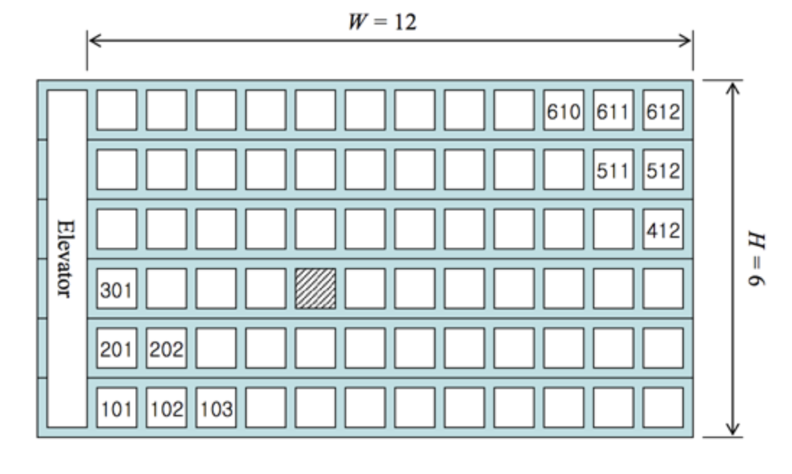




> Question



* Customers don't care about the distance they travel by elevator
* However, when the walking distance is the same, the room downstairs is preferred
* The contents print the room number to be assigned to the Nth guest

```txt
Input:
2
6 12 10
30 50 72

Output:
402
1203
```




```py
for _ in range(int(input())):
  h, w, n = map(int,input().split())
  print(f'{(n - 1) % h + 1}{(n - 1)// h + 1:02}')
```



